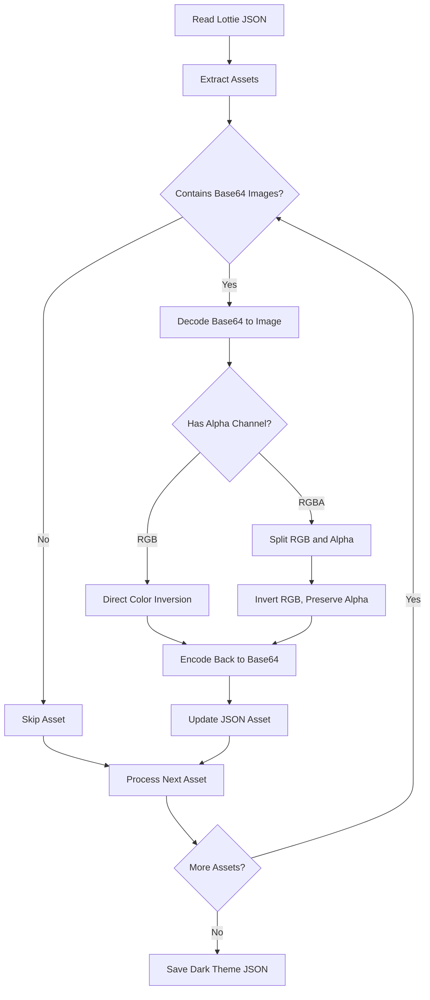

<div align="center">
 <h1>🎨 Lottie Theme Converter</h1>
 <h3>Smart Color Inversion for Lottie Animations</h3>

A powerful Python tool that intelligently converts Lottie animations between light and dark themes.<br/>
Preserves transparency and maintains animation quality while inverting embedded image colors.<br/>
One-click **FREE** theme conversion for your Lottie animations.

[Live Demo][demo-link] · [Documentation][docs-link] · [Report Bug][issues-link] · [Request Feature][issues-link]

<br/>

[][demo-link]

<br/>

<!-- SHIELD GROUP -->
[![][python-shield]][python-link]
[![][pillow-shield]][pillow-link]
[![][license-shield]][license-link]
[![][github-stars-shield]][github-stars-link]
[![][github-forks-shield]][github-forks-link]
[![][github-issues-shield]][github-issues-link]

**Share Lottie Theme Converter**

[![][share-x-shield]][share-x-link]
[![][share-telegram-shield]][share-telegram-link]
[![][share-whatsapp-shield]][share-whatsapp-link]
[![][share-reddit-shield]][share-reddit-link]
[![][share-linkedin-shield]][share-linkedin-link]

<sup>🌟 Pioneering intelligent theme conversion for Lottie animations. Built for designers and developers.</sup>

</div>

> [!TIP]
> **⭐ Star us** to receive all release notifications from GitHub without delay!

<details>
<summary><kbd>📑 Table of Contents</kbd></summary>

#### TOC

- [🌟 Introduction](#-introduction)
- [✨ Key Features](#-key-features)
  - [⚡ Smart Color Inversion](#-smart-color-inversion)
  - [🎨 Dual Theme Support](#-dual-theme-support)
  - [💻 Simple Python Implementation](#-simple-python-implementation)
  - [🔄 Base64 Image Processing](#-base64-image-processing)
  - [🚀 One-Click Conversion](#-one-click-conversion)
- [🛠️ Tech Stack](#️-tech-stack)
- [🚀 Getting Started](#-getting-started)
  - [Prerequisites](#prerequisites)
  - [Quick Installation](#quick-installation)
  - [Alternative Installation](#alternative-installation)
- [📖 Usage Guide](#-usage-guide)
  - [Basic Usage](#basic-usage)
  - [Advanced Configuration](#advanced-configuration)
  - [Integration Example](#integration-example)
- [🎯 How It Works](#-how-it-works)
  - [Technical Process](#technical-process)
- [📁 Project Structure](#-project-structure)
  - [Core Files](#core-files)
- [🤝 Contributing](#-contributing)
  - [Development Process](#development-process)
  - [Contribution Guidelines](#contribution-guidelines)
- [📄 License](#-license)
- [👥 Author](#-author)

####

<br/>

</details>

## 🌟 Introduction

We created this intelligent Lottie theme converter to solve a common problem faced by designers and developers: **seamlessly converting Lottie animations between light and dark themes** while preserving transparency and animation quality.

Whether you're building modern web applications, mobile apps, or any digital interface that supports both light and dark modes, this tool ensures your Lottie animations look perfect in any theme.

> [!NOTE]
> - Python 3.8+ required
> - Only Pillow library dependency
> - Works with any Lottie JSON file containing base64 images
> - Preserves alpha channel transparency

| [![][demo-shield-badge]][demo-link] | No complex setup required! Just run the script and get your themed animation. |
| :---------------------------------- | :---------------------------------------------------------------------------- |

> [!TIP]
> **⭐ Star us** to stay updated with new features and improvements!

## ✨ Key Features

### ⚡ Smart Color Inversion
Experience intelligent color processing that **inverts RGB channels while preserving alpha transparency**. Our algorithm ensures your animations maintain their visual quality and transparency effects.

### 🎨 Dual Theme Support  
Perfect for applications requiring both light and dark mode animations. Convert your light theme animations to dark theme versions effortlessly.

### 💻 Simple Python Implementation
Clean, readable Python code using only the Pillow library. Easy to understand, modify, and integrate into your workflow.

### 🔄 Base64 Image Processing
Efficiently processes base64 encoded images embedded directly in Lottie JSON files without requiring external image files.

### 🚀 One-Click Conversion
Simply place your Lottie file and run the script. Your dark theme animation will be generated instantly.

## 🛠️ Tech Stack

<div align="center">
  <table>
    <tr>
      <td align="center" width="96">
        
        <br>Python 3.8+
      </td>
      <td align="center" width="96">
        
        <br>Pillow 11.0.0
      </td>
      <td align="center" width="96">
        
        <br>Lottie JSON
      </td>
    </tr>
  </table>
</div>

**Core Technologies:**
- **Python 3.8+**: Main programming language
- **Pillow (PIL) 11.0.0**: Image processing library
- **JSON**: Lottie animation file format
- **Base64**: Image encoding/decoding

## 🚀 Getting Started

### Prerequisites

> [!IMPORTANT]
> Ensure you have Python 3.8+ installed on your system.

### Quick Installation

**1. Clone Repository**

```bash
git clone https://github.com/ChanMeng666/lottie-edit.git
cd lottie-edit
```

**2. Install Dependencies**

```bash
pip install -r requirements.txt
```

**3. Prepare Your Animation**

Place your light theme Lottie animation file as `Animation-ClickMe.json` in the project directory.

**4. Run Conversion**

```bash
python convert_lottie.py
```

🎉 **Success!** Your dark theme animation will be saved as `Animation-ClickMe-dark.json`.

### Alternative Installation

```bash
# Install Pillow directly
pip install pillow==11.0.0

# Download the script
wget https://raw.githubusercontent.com/ChanMeng666/lottie-edit/main/convert_lottie.py
```

## 📖 Usage Guide

### Basic Usage

**Step 1: Prepare Your Lottie File**
- Ensure your Lottie JSON file contains base64 encoded images
- Save it as `Animation-ClickMe.json` in the project directory

**Step 2: Run the Conversion**
```bash
python convert_lottie.py
```

**Step 3: Get Your Result**
- The converted dark theme animation will be saved as `Animation-ClickMe-dark.json`
- Use this file in your dark mode interface

### Advanced Configuration

To customize input/output filenames, modify the script:

```python
# Change input filename
with open('your-animation.json', 'r') as f:
    data = json.load(f)

# Change output filename  
with open('your-animation-dark.json', 'w') as f:
    json.dump(data, f)
```

### Integration Example

```javascript
// Use in web applications
const isDarkMode = window.matchMedia('(prefers-color-scheme: dark)').matches;
const animationPath = isDarkMode ? 
    './animations/Animation-ClickMe-dark.json' : 
    './animations/Animation-ClickMe.json';

lottie.loadAnimation({
    container: element,
    renderer: 'svg',
    loop: true,
    autoplay: true,
    path: animationPath
});
```

## 🎯 How It Works

The conversion process follows these intelligent steps:



### Technical Process

1. **JSON Parsing**: Load and parse the Lottie JSON file
2. **Asset Detection**: Identify base64 encoded images in the assets array
3. **Image Decoding**: Convert base64 strings back to image objects
4. **Smart Inversion**: 
   - For RGBA images: Separate RGB and Alpha channels
   - Invert RGB values: `new_value = 255 - original_value`
   - Preserve Alpha channel unchanged
5. **Re-encoding**: Convert processed images back to base64
6. **JSON Update**: Replace original base64 data with inverted versions
7. **File Generation**: Save the new dark theme JSON file

## 📁 Project Structure

```
lottie-edit/
├── convert_lottie.py          # Main conversion script
├── requirements.txt           # Python dependencies
├── Animation-ClickMe.json     # Sample light theme animation
├── Animation-ClickMe-dark.json # Generated dark theme animation
├── README.md                  # Project documentation
├── LICENSE                    # MIT license
└── CODE_OF_CONDUCT.md        # Community guidelines
```

### Core Files

| File | Description | Purpose |
|------|-------------|---------|
| `convert_lottie.py` | Main Python script | Handles the theme conversion logic |
| `requirements.txt` | Dependencies list | Specifies Pillow version requirement |
| `Animation-ClickMe.json` | Sample input file | Example light theme Lottie animation |
| `Animation-ClickMe-dark.json` | Sample output file | Generated dark theme animation |

## 🤝 Contributing

We welcome contributions! Here's how you can help improve this project:

### Development Process

**1. Fork & Clone:**
```bash
git clone https://github.com/ChanMeng666/lottie-edit.git
cd lottie-edit
```

**2. Create Branch:**
```bash
git checkout -b feature/your-feature-name
```

**3. Make Changes:**
- Follow Python best practices
- Add comments for complex logic
- Test with various Lottie files
- Update documentation as needed

**4. Submit PR:**
- Provide clear description
- Include example files if applicable
- Ensure the script works with different animation types

### Contribution Guidelines

**Code Style:**
- Follow PEP 8 Python style guidelines
- Add docstrings for functions
- Use meaningful variable names
- Include error handling

**Pull Request Process:**
1. Update README.md if needed
2. Test with multiple Lottie files
3. Ensure compatibility with Pillow 11.0.0
4. Request review from maintainers

**Issue Reporting:**
- 🐛 **Bug Reports**: Include Lottie file samples and error messages
- 💡 **Feature Requests**: Explain use case and benefits
- 📚 **Documentation**: Help improve our guides
- ❓ **Questions**: Use GitHub Discussions

## 📄 License

This project is licensed under the MIT License - see the [LICENSE](LICENSE) file for details.

**Open Source Benefits:**
- ✅ Commercial use allowed
- ✅ Modification allowed
- ✅ Distribution allowed
- ✅ Private use allowed

## 👥 Author

<div align="center">
  <table>
    <tr>
      <td align="center">
        <a href="https://github.com/ChanMeng666">
          
          <br />
          <sub><b>Chan Meng</b></sub>
        </a>
        <br />
        <small>Creator & Lead Developer</small>
      </td>
    </tr>
  </table>
</div>

**Contact Information:**
- 📧 **Email**: [chanmeng.dev@gmail.com](mailto:chanmeng.dev@gmail.com)
- 💼 **LinkedIn**: [chanmeng666](https://www.linkedin.com/in/chanmeng666/)
- 🐦 **GitHub**: [ChanMeng666](https://github.com/ChanMeng666)
- 🌐 **Website**: [chanmeng.live](https://2d-portfolio-eta.vercel.app/)

---

<div align="center">
<strong>🎨 Revolutionizing Lottie Animation Theming 🌟</strong>
<br/>
<em>Empowering designers and developers worldwide</em>
<br/><br/>

⭐ **Star us on GitHub** • 📖 **Read the Documentation** • 🐛 **Report Issues** • 💡 **Request Features** • 🤝 **Contribute**

<br/><br/>

**Made with ❤️ by the Lottie Theme Converter team**


</div>

---

<!-- LINK DEFINITIONS -->

<!-- Project Links -->
[demo-link]: https://github.com/ChanMeng666/lottie-edit
[docs-link]: https://github.com/ChanMeng666/lottie-edit#readme
[issues-link]: https://github.com/ChanMeng666/lottie-edit/issues

<!-- GitHub Links -->
[github-stars-link]: https://github.com/ChanMeng666/lottie-edit/stargazers
[github-forks-link]: https://github.com/ChanMeng666/lottie-edit/forks
[github-issues-link]: https://github.com/ChanMeng666/lottie-edit/issues
[license-link]: https://github.com/ChanMeng666/lottie-edit/blob/main/LICENSE

<!-- External Links -->
[python-link]: https://www.python.org/
[pillow-link]: https://pillow.readthedocs.io/

<!-- Shield Badges -->
[python-shield]: https://img.shields.io/badge/python-3.8%2B-blue?style=flat-square&logo=python&logoColor=white
[pillow-shield]: https://img.shields.io/badge/pillow-11.0.0-orange?style=flat-square&logo=python&logoColor=white
[license-shield]: https://img.shields.io/badge/license-MIT-brightgreen?style=flat-square
[github-stars-shield]: https://img.shields.io/github/stars/ChanMeng666/lottie-edit?color=ffcb47&labelColor=black&style=flat-square
[github-forks-shield]: https://img.shields.io/github/forks/ChanMeng666/lottie-edit?color=8ae8ff&labelColor=black&style=flat-square
[github-issues-shield]: https://img.shields.io/github/issues/ChanMeng666/lottie-edit?color=ff80eb&labelColor=black&style=flat-square

<!-- Badge Variants -->
[demo-shield-badge]: https://img.shields.io/badge/TRY%20DEMO-ONLINE-4CAF50?labelColor=black&style=for-the-badge

<!-- Social Share Links -->
[share-x-link]: https://x.com/intent/tweet?hashtags=opensource,lottie,animation&text=Check%20out%20this%20amazing%20Lottie%20theme%20converter&url=https%3A%2F%2Fgithub.com%2FChanMeng666%2Flottie-edit
[share-telegram-link]: https://t.me/share/url?text=Check%20out%20this%20Lottie%20theme%20converter&url=https%3A%2F%2Fgithub.com%2FChanMeng666%2Flottie-edit
[share-whatsapp-link]: https://api.whatsapp.com/send?text=Check%20out%20this%20Lottie%20theme%20converter%20https%3A%2F%2Fgithub.com%2FChanMeng666%2Flottie-edit
[share-reddit-link]: https://www.reddit.com/submit?title=Amazing%20Lottie%20Theme%20Converter&url=https%3A%2F%2Fgithub.com%2FChanMeng666%2Flottie-edit
[share-linkedin-link]: https://linkedin.com/sharing/share-offsite/?url=https://github.com/ChanMeng666/lottie-edit

[share-x-shield]: https://img.shields.io/badge/-share%20on%20x-black?labelColor=black&logo=x&logoColor=white&style=flat-square
[share-telegram-shield]: https://img.shields.io/badge/-share%20on%20telegram-black?labelColor=black&logo=telegram&logoColor=white&style=flat-square
[share-whatsapp-shield]: https://img.shields.io/badge/-share%20on%20whatsapp-black?labelColor=black&logo=whatsapp&logoColor=white&style=flat-square
[share-reddit-shield]: https://img.shields.io/badge/-share%20on%20reddit-black?labelColor=black&logo=reddit&logoColor=white&style=flat-square
[share-linkedin-shield]: https://img.shields.io/badge/-share%20on%20linkedin-black?labelColor=black&logo=linkedin&logoColor=white&style=flat-square
